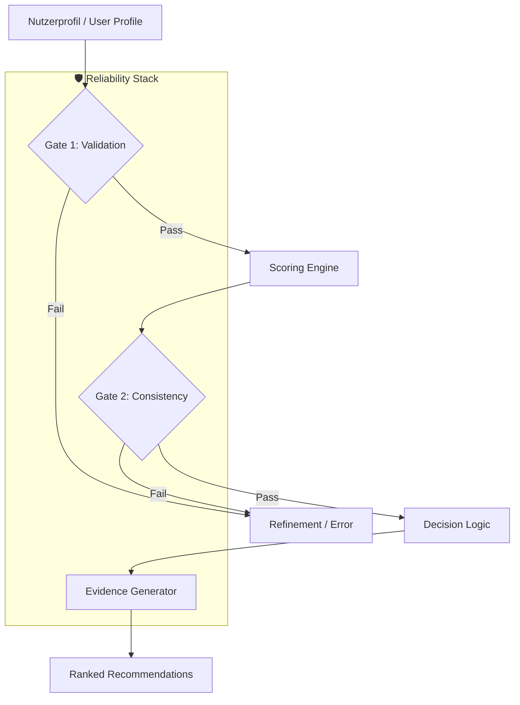
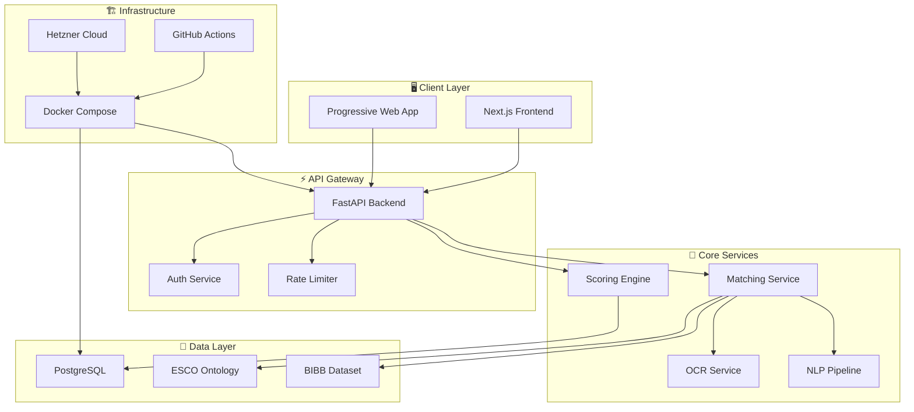

# 🎯 LUCY — AI-Powered Decision Pipeline for Career Guidance

> **Reliable GenAI-guided career recommendations through structured decision logic.**
>
> *Verlässliche, KI-gestützte Berufsberatung durch strukturierte Entscheidungslogik.*

---

## 🎬 Recruiter Quick-Check (3 Minutes)

| Aspect | Details |
|:---|:---|
| **Problem Solved** | Moving from generic AI talk to reliable, structured career guidance. |
| **The "Lucy" Edge** | Multi-stage **Gate & Scoring Pipeline** for hallucination reduction. |
| **Reliability** | Evidence-based recommendations with proof-of-decision audit trails. |
| **Tech Stack** | FastAPI, Python 3.11, Next.js 14, PostgreSQL (Vector-ready). |
| **Domain Logic** | Integration with ESCO (European Skills/Occupations) & BIBB datasets. |
| **Impact** | Reduction of dropouts and wrong career decisions through transparency. |

---

## 🧠 Core Concept: The Decision Pipeline

Unlike standard wrappers, Lucy implements a high-integrity pipeline that acts as a **truth gate** between the LLM and the user.



**Key Pillars:**
1. **Verification Gates:** Rules-based constraints that filter out illogical paths before the AI generates content.
2. **Scoring Engine:** Weighted matching against regional and industrial labor market data.
3. **Evidence Generation:** Every recommendation is linked to specific user data points (Traceability).

---

## 📐 System Architecture



---

## 🚀 Key Features

| Feature | Description | Status |
|:---|:---|:---|
| **Interest Profiling** | Questionnaire-based career interest analysis | ✅ Production |
| **ESCO Integration** | EU-standard occupation taxonomy mapping | ✅ Production |
| **CV Analysis** | OCR + NLP extraction from uploaded CVs | ✅ Production |
| **Smart Matching** | Vector-based job/education recommendations | ✅ Production |
| **Privacy-First** | GDPR-compliant, U18 data stays local | ✅ Production |
| **Bilingual** | Full DE/EN support | ✅ Production |

---

## 📁 Repository Structure

```
lucy-showcase/
├── docs/                    # Technical documentation (EN + DE)
│   ├── architecture.*.md    # System architecture deep-dive
│   ├── proof_system.*.md    # Evidence generation system
│   ├── security.*.md        # Security model & practices
│   ├── faq_recruiters.*.md  # FAQ for technical recruiters
│   ├── one_pager.*.md       # Executive summary
├── examples/                # Sample configurations & proofs
│   └── config_examples/     # Sanitized configs
└── README.md                # This file
```

---

## 🔐 Security

- **Secret Scanning**: Pre-commit hooks with `detect-secrets`
- **No Credentials**: All examples use synthetic data
- **GDPR Compliant**: Privacy-by-design architecture
- **Audit Trail**: Cryptographic proof of deployments

See [docs/security.en.md](docs/security.en.md) for details.

---

## 📚 Documentation

| Document | EN | DE |
|:---|:---|:---|
| Architecture | [architecture.en.md](docs/architecture.en.md) | [architecture.de.md](docs/architecture.de.md) |
| Proof System | [proof_system.en.md](docs/proof_system.en.md) | [proof_system.de.md](docs/proof_system.de.md) |
| Security | [security.en.md](docs/security.en.md) | [security.de.md](docs/security.de.md) |
| Recruiter FAQ | [faq_recruiters.en.md](docs/faq_recruiters.en.md) | [faq_recruiters.de.md](docs/faq_recruiters.de.md) |
| One Pager | [one_pager.en.md](docs/one_pager.en.md) | [one_pager.de.md](docs/one_pager.de.md) |

---

## 👤 Developer

**Dennis Dittfurth**
- GitHub: [@Carefree1987](https://github.com/Carefree1987)
- Role: Full-Stack Developer & System Architect

---

## 📄 License

All rights reserved. This is a showcase repository — the material may be viewed for evaluation purposes; the underlying system is private IP.

---

<p align="center">
  <i>Built with 🦅 precision and enterprise-grade quality.</i>
</p>
