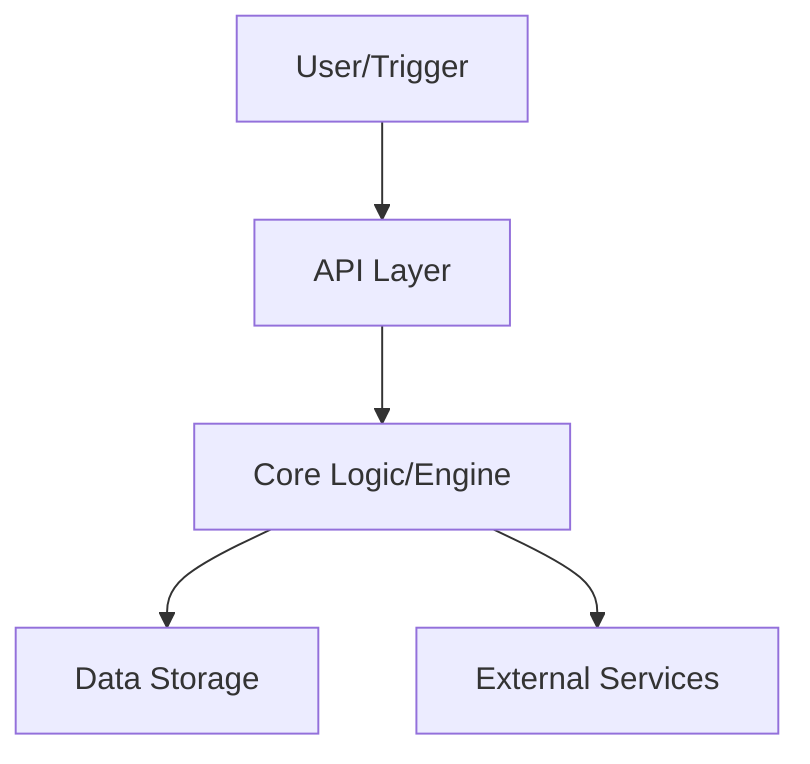

# LUCY - Automated Career Intelligence Showcase


> Demonstration of AI-driven job discovery and resume optimization.

---

## 🚀 Overview
LUCY - Automated Career Intelligence Showcase is a production-ready solution focused on reliability, performance, and clear architecture. 
Designed for scalability and maintainability.

## ✨ Key Features
- Global Job Discovery Connectors- Multi-factor Scoring Engine- Automated Application Pack Workflows- Career Visualization Dashboard

## 🛠 Tech Stack
`Python`, `Automation`, `n8n`, `Scoring Engine`

## 🏗 Architecture


## 📦 Installation & Setup
```bash
# Clone the repository
git clone https://github.com/Carefree1987/lucy-showcase
cd lucy-showcase

# Setup environment
python -m venv venv
source venv/bin/activate  # or venv\Scripts\activate on Windows

# Install dependencies
pip install -r requirements.txt
```

## ⚖️ License
This project is licensed under the MIT License - see the [LICENSE](LICENSE) file for details.

## ✉️ Contact
Created by [KayD83](https://github.com/Carefree1987) - Feel free to reach out for collaboration!
