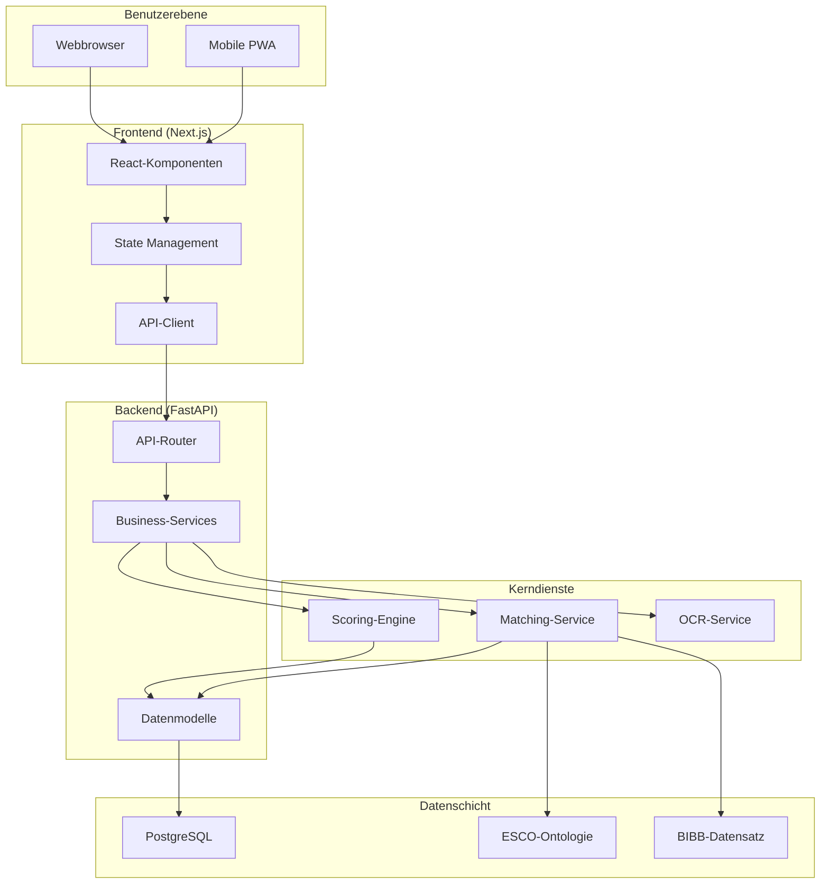

# Systemarchitektur

## Überblick

Lucy ist eine auf Microservices basierende Berufsberatungsplattform, die auf Datenschutz, Skalierbarkeit und **hochwertige Entscheidungslogik** ausgelegt ist. Sie schließt die Lücke zwischen generativer KI und verlässlicher Beratung.

## Die Decision Pipeline: Reliability by Design

Die Kerninnovation von Lucy ist die **Decision Pipeline** – ein mehrstufiger Validierungsprozess, der sicherstellt, dass jede Empfehlung auf Fakten und Arbeitsmarkt-Daten basiert.

1. **Validation Gates**: 
   - Strikte Schema-Validierung von Input und Output.
   - Domänenspezifische Constraints (z.B. Prüfung, ob vorgeschlagene Skills in der ESCO-Taxonomie existieren).
2. **Scoring & Logik-Engine**:
   - Vektor-basiertes Matching kombiniert mit gewichteten Scoring-Modellen.
   - Logik-Checks zur Vermeidung von „unmöglichen“ Empfehlungen.
3. **Evidence Generation (Nachweisbarkeit)**:
   - Automatische Generierung von Begründungen („Warum diese Empfehlung?“).
   - Audit Trail, der die Empfehlung direkt mit den ursprünglichen Profildaten verknüpft.

## Komponentendiagramm

## Wichtige Design-Entscheidungen

| Entscheidung | Begründung |
|:---|:---|
| **Microservices** | Unabhängige Skalierung, einfacheres Testen, klare Grenzen |
| **FastAPI** | Hohe Performance, Async-Support, automatische OpenAPI-Docs |
| **Next.js** | SSR für SEO, React-Ökosystem, hervorragende Developer Experience |
| **PostgreSQL** | ACID-Konformität, JSON-Unterstützung, ausgereiftes Ökosystem |
| **Docker** | Reproduzierbare Deployments, einfache Skalierung |
| **GitHub Actions** | Native CI/CD, Secrets-Management, Artefakt-Speicherung |

## Datenfluss

1. **Benutzereingabe**: Fragebogen-Antworten oder CV-Upload
2. **Verarbeitung**: NLP-Extraktion, Interessen-Scoring
3. **Matching**: Vektor-Ähnlichkeit gegen ESCO/BIBB
4. **Antwort**: Gerankte Karriereempfehlungen

## Sicherheitsarchitektur

- Alle Daten verschlüsselt im Ruhezustand und bei der Übertragung
- Keine PII-Speicherung für Benutzer unter 18 Jahren
- DSGVO-konforme Datenverarbeitung
- Rate-Limiting auf allen Endpunkten
