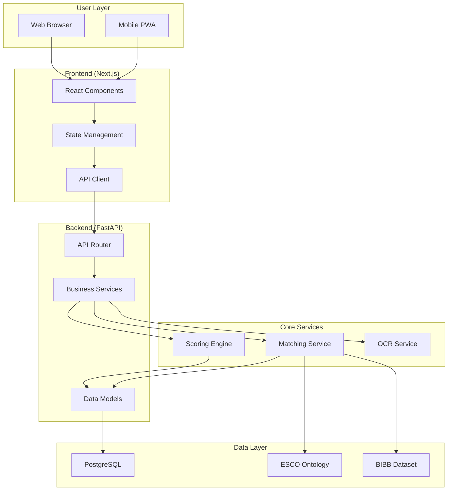

# System Architecture

## Overview

Lucy is a microservices-based career guidance platform designed for privacy, scalability, and **high-integrity decision making**. It bridges the gap between raw LLM capabilities and reliable career guidance.

## The Decision Pipeline: Reliability by Design

The core innovation of Lucy is the **Decision Pipeline**, a multi-stage validation process that ensures every recommendation is grounded in evidence and labor market data.

1. **Validation Gates**: 
   - Strict input/output schema validation.
   - Domain-specific constraints (e.g., verifying that suggested skills exist in the ESCO taxonomy).
2. **Scoring & Logic Engine**:
   - Vector-based matching combined with weighted scoring.
   - Logic checks to prevent "impossible" recommendations (e.g., jobs requiring degrees the user cannot realistically obtain).
3. **Evidence Generation**:
   - Automatic generation of "Why this?"-snippets.
   - Audit trail connecting the recommendation back to the original user profile data.

## Component Diagram

## Key Design Decisions

| Decision | Rationale |
|:---|:---|
| **Microservices** | Independent scaling, easier testing, clear boundaries |
| **FastAPI** | High performance, async support, automatic OpenAPI docs |
| **Next.js** | SSR for SEO, React ecosystem, great DX |
| **PostgreSQL** | ACID compliance, JSON support, mature ecosystem |
| **Docker** | Reproducible deployments, easy scaling |
| **GitHub Actions** | Native CI/CD, secrets management, artifact storage |

## Data Flow

1. **User Input**: Questionnaire answers or CV upload
2. **Processing**: NLP extraction, interest scoring
3. **Matching**: Vector similarity against ESCO/BIBB
4. **Response**: Ranked career recommendations

## Security Architecture

- All data encrypted at rest and in transit
- No PII stored for users under 18
- GDPR-compliant data handling
- Rate limiting on all endpoints
