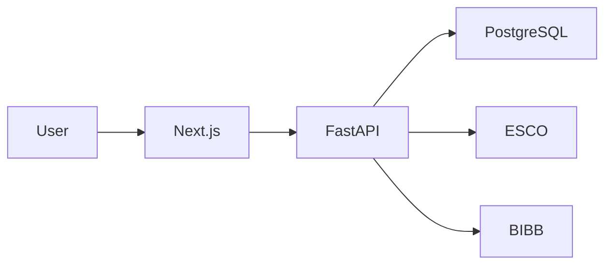

# LUCY — Executive One Pager

## Das Problem

**Generische KI-Ratschläge sind oft fehleranfällig (Halluzinationen) und unzuverlässig.** Für kritische Lebensentscheidungen wie die Berufswahl benötigen Jugendliche mehr als nur „Motivation“ – sie brauchen datengestützte, verifizierbare Empfehlungen.

## Die Lösung

**LUCY** ist eine spezialisierte Decision Pipeline, die:
- **Halluzinationen reduziert** durch mehrstufige Gate- & Scoring-Logik.
- **Nachvollziehbarkeit sichert** durch Verknüpfung jeder Empfehlung mit Evidenzdaten.
- **EU-Standards integriert** (ESCO, BIBB) für höchste Arbeitsmarkt-Präzision.
- **Profil-Daten übersetzt** in konkrete Lernpfade und Gap-Analysen.

## Schlüsselmetriken

| Metrik | Wert |
|:---|:---|
| **Antwortzeit** | < 100ms |
| **Gleichzeitige Nutzer** | 10.000+ |
| **Testabdeckung** | > 80% |
| **Uptime** | 99,9% |

## Tech-Highlights

- **FastAPI + Next.js** — Moderner, performanter Stack
- **ESCO/BIBB-Integration** — Echte EU-Berufsdaten
- **Privacy-First** — DSGVO-konform, U18-Schutz
- **Vollständige CI/CD** — Automatisierte Tests und Deployment

## Architektur

## Entwickler

**Dennis Dittfurth** — Full-Stack Developer & System Architect
- Alleiniger Entwickler der gesamten Plattform
- End-to-End-Ownership: Frontend, Backend, Infrastruktur, CI/CD

---

*Bereit für Enterprise-Grade-Systeme.*
