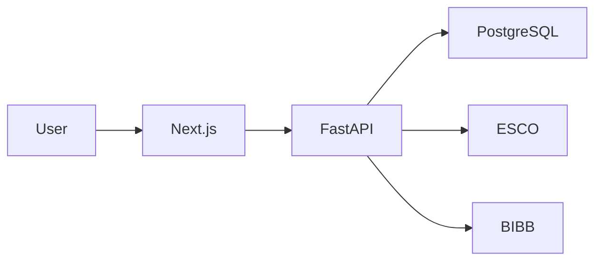

# LUCY — Executive One Pager

## The Problem

**Generic AI advice is often hallucination-prone and unreliable.** For critical life decisions like career guidance, youth need more than just "motivation" – they need data-driven, verifiable recommendations.

## The Solution

**LUCY** is a specialized decision pipeline that:
- **Reduces Hallucinations** through multi-stage Gate & Scoring logic.
- **Ensures Traceability** by linking every recommendation to evidence.
- **Integrates EU Standards** (ESCO, BIBB) for labor market accuracy.
- **Translates Profiling Data** into actionable learning paths and gap analyses.

## Key Metrics

| Metric | Value |
|:---|:---|
| **Response Time** | < 100ms |
| **Concurrent Users** | 10,000+ |
| **Test Coverage** | > 80% |
| **Uptime** | 99.9% |

## Tech Highlights

- **FastAPI + Next.js** — Modern, performant stack
- **ESCO/BIBB Integration** — Real EU occupation data
- **Privacy-First** — GDPR-compliant, U18 protection
- **Full CI/CD** — Automated testing and deployment

## Architecture

## Developer

**Dennis Dittfurth** — Full-Stack Developer & System Architect
- Sole developer of the entire platform
- End-to-end ownership: Frontend, Backend, Infrastructure, CI/CD

---

*Ready to build enterprise-grade systems.*
